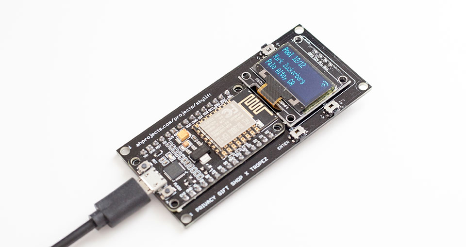

# Skylift V1.0 Jan 2019

SkyLift is a low-cost DIY Wi-FI geolocation spoofing device. It uses the ESP8266 to broadcast Wi-Fi Beacon Frames that exploit a longstanding (2008) vulnerability in Wi-Fi geolocation services. 




Version 1.0 includes improvements:

- only two commands are needed to go from GPS coords to Arduino firmware
- job files to process Wigle request, coversion to Arduino, and iOS scan conversion
- removed vendors (not really useful)
- improved timing
- reduced SSID names to 6 characters to improve speed (ESP seems to slow down when handling too many array operations and then broadcast timing accuracy slips)
- added notebook for plotting lat/lon (needs more work)
- Changed to Click CLI interface

Documentation for the previous version can be found [docs/README_v1.md]

## Getting Started: Python

 Setup virutal environment

- `git clone https://github.com/adamhrv/skylift`
- `cd skylift`
- `virtualenv --no-site-packages -p python3 venv `
- `source venv/bin/activate`
- `pip install -r requirments`

Download test data from Wigle

- first you'll need to register on <Wigle.net>
- `cp env-sample env`
- `nano env/wigle-username.env.env` and add your credentials
  - `WIGLE_API_NAME=your_username`
  - `WIGLE_API_TOKEN=your_token`
- add un/pw to your environment variables: `source env/wigle-username.env`
- `cd skylift`
- run `python cli_jobs.py` you should see the output below


```
venv) ➜  skylift git:(master) ✗ python cli_jobs.py 
Usage: cli_jobs.py [OPTIONS] COMMAND1 [ARGS]... [COMMAND2 [ARGS]...]...

Options:
  -v, --verbose  Verbosity: -v DEBUG, -vv INFO, -vvv WARN, -vvvv ERROR, -vvvvv
                 CRITICAL  [default: 4]
  --help         Show this message and exit.

Commands:
  arduino       Converts JSON to arduino .h file
  ios           Convert iOS Airpot utility scan to networks JSON
  wigle         Fetches Wigle data
  wigle_export  Processed Exported Wigle data
```

## Getting Started: Arduino


- Purchase an ESP8266 NodeMCU 12 or 12E | [eBay](http://www.ebay.com/itm/NodeMcu-Lua-WIFI-Internet-Things-development-board-based-ESP8266-CP2102-module-/201542946669?hash=item2eece54f6d:g:EOIAAOSw4q9XT5mo) (cheaper) or [Amazon.com](https://www.amazon.com/HiLetgo-Version-NodeMCU-Internet-Development/dp/B010O1G1ES/) (quicker)
- Purchase an OLED display | [eBay](http://www.ebay.com/itm/0-96-I2C-IIC-SPI-Serial-128X64-White-OLED-LCD-LED-Display-Module-for-Arduino-/201428440360?hash=item2ee6121528:g:MOYAAOSwv0tVeD0N), [Amazon.com](https://www.amazon
- Install Arduino
- Install libraries
	- Adafruit SSD1306
	- Adafruit GFX
	- Ace Button
- Add `http://arduino.esp8266.com/stable/package_esp8266com_index.json` to boards manager
- Select board profile: `NodeMCU 1.0 (ESP12-E Module)`
- install CP2102 driver https://www.silabs.com/products/development-tools/software/usb-to-uart-bridge-vcp-drivers

## Getting Started: Jobs

- setup a job in the `data/jobs/wigle.csv` file


Convert Wigle Data to Arduino Sketch

- edit `data/jobs/arduino.csv` to add file names from Wigle scan outputs
- `python cli_jobs arduino`
- copy the networks folder into your Arudino sketch

## Getting Started: Data

- MacOS: use OSX scanner utility
- iOS: use iOS Wi-Fi scanning utility
- Android: use Wigle App
- Linux: (to be implemented)
- see [Scanning Instructions](docs/scanning_instructions.md) for instructions on creating Wi-Fi datasets


## Use Cases


- Build a Wi-Fi geolocation spoofing device that tricks your phone into being at Julian Assange's residence in London
- clone a nearby location to fuzz accuracy of your actual location
- 


## Prototypes

Sky

pi_esps.jpg

------------------------

## TODO

- add notes on creating job files
- add Wigle app export processor
- add instructions for Arduino sketch


### SkyLift at Exhibitions:

- [*Dark Technology Dark Web*](spektrumberlin.de/exhibitions/detail/exhibition-10-dark-technology-dark-web.html). Spektrum. Berlin. 2017.
- [How Much of This is Fiction](http://www.fact.co.uk/projects/how-much-of-this-is-fiction.aspx). FACT. Liverpool. 2017.
- [*Lanceurs d'alerte*](https://gaite-lyrique.net/lanceurs-dalerte-0) . La Gaîté Lyrique. Paris. 2017.
- [*Welcome to Ecuador*](http://www.zoogalerie.fr/?p=2059&preview=true). Zoo Galerie. 2016.

### SkyLift Credits:

- Original concept developed in collaboration with [!Mediengruppe Bitnik](https://wwwwwwwwwwwwwwwwwwwwww.bitnik.org/) (DE)
- SkyLift V0.1 developed in collaboration with [Surya Mattu](http://suryamattu.com) (US) 
- V0.1 technical advisement from [Julian Oliver](https://julianoliver.com) (DE)
- Research assistance and Python development contributions: [Leon Eckert](http://leoneckert.com/) (US/DE)
- ["Welcome to Ecuador"](http://www.zoogalerie.fr/?p=2059&preview=true) installation (2016) curated by [Aude Launay](http://launayau.de/) for Zoo Galerie
- ESP8266 proof of concept Beacon Frame code by <https://github.com/kripthor/WiFiBeaconJam>
- [Schloss Solitude Web Residency](https://schloss-post.com/skylift-low-cost-geo-location-spoofing-device/)


### Disclaimer

- Pokémon players, and others, use at your own risk
- Currently intended for research and artistic purposes only
- Check local Wi-Fi regulations before using 
- After a sustained duration of broadcasting,  BSSIDs may be blacklisted or even become associated with another location (this happened at [FACT Liverpool](http://www.fact.co.uk/), which could reveal your location to other users, or be used creatively for a *Bermuda Triangle* effect.
- SkyLift is not a GPS spoofing device. For 1.5GHz GPS spoofing, see [Spoof GPS location with low cost TX SDRs](http://hackaday.com/2016/07/19/pokemon-go-cheat-fools-gps-with-software-defined-radio/) or [Software-Defined GPS Signal Simulator](https://github.com/osqzss/gps-sdr-sim)
- SkyLift is currently a 2.4GHz only device
- **SkyLift is a work in progress and does not always work. Although it has worked very well in controlled environemnts, to be more useful in the real world it either needs more debugging and/or an additional Bluetooth spoofing component. Further research is needed to determine the order of operations for geolocation positioning using combination of cell, wifi, bluetooth, and gps signals.**
- SkyLift is a uniqe approach because it can be deployed with minimal resources (≈$5 per device) compard to more complex and expensive GPS spoofing technologies


### Further Reading

- [Beacon Frame Overview](https://en.wikipedia.org/wiki/Beacon_frame)
- [Beacon Frame Packet](https://mrncciew.com/2014/10/08/802-11-mgmt-beacon-frame/) in more depth
- [Spoofing WiFi Geolocation services](http://www.senet-int.com/2013/12/wi-fi-geo-location/) on Hackaday
- [Don't Trust Geolocation](http://www.journaldulapin.com/2013/08/26/dont-trust-geolocation/)
- [Device-to-Identity Linking Attack Using Targeted Wi-Fi Geolocation Spoofing](https://hal.inria.fr/hal-01176842/document)
- [SkyLift V0.1 post on using MDK3 + Raspberry Pi](https://ahprojects.com/notebook/2016/skylift-geolocation/)

## History

Version 0.5

- reduced build cost from $50 to about $5
- reduced setup time for core technology from several hours to about 15 minutes
- improved user operation (simply provide USB power)
- improved performance by channel hopping
- improved packet structure (added timestamp interval byte)
- added hidden (null) SSID option "\x00"
- added utility scripts for creating custom locations
- isolated technology to a single device
- added optional OLED for display

 
SkyLift is open source project maintained by [Adam Harvey](https://ahprojects.com) that investigates security vulnerabilities and creative opportunities in consumer-facing smartphone geolocation services. 


## Research 

- <http://www.rfwireless-world.com/Terminology/WLAN-beacon-frame.html>
- <http://www.rfwireless-world.com/Articles/WLAN-MAC-layer-protocol.html>
- <http://www.sharetechnote.com/html/WLAN_Beacon.html>
- <http://www.sharetechnote.com/html/WLAN_FrameStructure.html#MAC_Header_Ex_01>
- <https://www.saltwaterc.eu/forging-an-802-11-beacon-frame.html>
- <http://www.zytrax.com/tech/wireless/802_mac.htm>
- <https://witestlab.poly.edu/blog/802-11-wireless-lan-2/>
- <https://mrncciew.com/2014/10/08/802-11-mgmt-beacon-frame/>
- <https://en.wikipedia.org/wiki/List_of_WLAN_channels>
- Japan: 12, 13, 14. Most of world is: 12, 13. US is only 1 - 11

------

