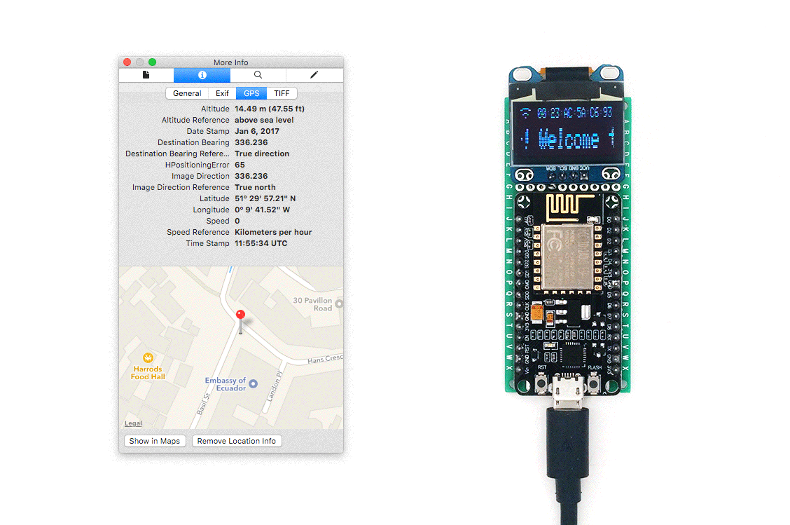
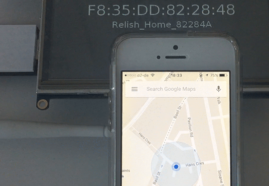
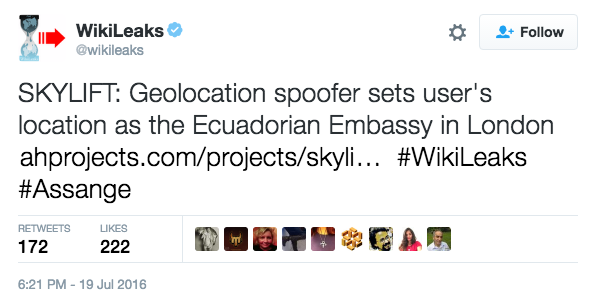

*Interview with Clara Herrmann for Schloss Solitude*

#### What is SkyLift? How did the project start and how does it work?

SkyLift is a low-cost device for geolocation spoofing. It uses a small WiFi microcontroller (ESP8266) to replay WiFi signals used for geolocation services allowing a smartphone user to virtually appear nearly anywhere in the world.

SkyLift V0.3: ESP8266 NodeMCU

The first version of SkyLift [(V0.1)](https://ahprojects.com/notebook/2016/skylift-geolocation/) was created in the summer of 2016 in collaboration with [Surya Mattu](http://suryamattu.com) for [!Mediengruppe Bitnik's](http://wwwwwwwwwwwwwwwwwwwwww.bitnik.org/) exhibition "Welcome to Ecuador!" at [Zoo Galerie](http://www.zoogalerie.fr/) in Nantes. The concept was to virtually relocate visitors inside !Mediengruppe Bitnik's recreation of Julian Assange's room in Nantes to his real location at the Ecuadorian Embassy in London. This first prototype used a Raspberry Pi and software called [mdk3](https://ahprojects.com/notebook/2016/skylift-geolocation/www.pseudocode.info/post/50127404555/beacons-beacons-everywhere-using-mdk3-for-ssid) (a beacon frame generator) to emulate the WiFi infrastructure at the Ecuadorian Embassy in London. 

SkyLift V0.1: Raspberry Pi, TP-Link 722N, mdk3

Functionally, the device worked well. Visitors in Nantes were successfully relocated to Julian Assange's real residence in London, overpowering their phone's other geolocation services such as space-based GPS and cellular triangulation.

But the project was difficult to setup and demonstrate. It used one computer for collecting the WiFi data on site at the Embassy in London and another separate computer for rebroadcasting them in Nantes. Both computers needed to be setup with custom software and this required too much time and prior knowledge. Instructions were posted on GitHub to build the device but people reported difficulty with the setup and results. This technical barrier to entry is further supported by the history of WiFi geolocation spoofing, which was first discovered over 9 years ago by [Professor Srdjan Capkun](http://www.ethlife.ethz.ch/archive_articles/080417_WiFi_location_spoofing/index_EN.html) at ETH Zurich. In his report, Professor Capkun makes clear that a smartphone's location can be easily spoofed by forging a router's MAC address and rebroadcasting its Beacon Frames. Despite their early warning in 2008, this vulnerability still existed in 2012 when Bengt Sjölen and Gordan Savicic creatively exploited it for their 2012 project [Packetbridge](https://criticalengineering.org/projects/packetbridge/). All three projects (Capkun's device in 20018, Packetbridge in 2012, and SkyLift V0.1 in 2016) make clear that geolocation spoofing is technically feasible, but still too technically challenging to be reach a larger audience.

For this web residency with Schloss Solitude, I'm releasing the 3rd version of the SkyLift device along with the code and instructions <https://github.com/adamhrv/skylift/> for how to build your own device for less than $5.

Compared to the first version of SkyLift, the main improvements are:

- reduced build cost from $50 to about $5
- reduced setup time for core technology from several hours to about 15 minutes
- improved user operation (simply provide USB power)
- added utility scripts creating custom locations
- isolated technology to a single device
- added optional OLED for display

Most of the improvements over the first version of SkyLift (V0.1), which used a Raspberry Pi computer and external WiFi adapter, can be attributed to the improved accessibility of the ESP8266 device that was developed by the Arduino community at large. SkyLift (V0.3) takes advantage of, in particular, one not well documented feature of the ESP8266 to broadcast the unique Beacon Frame that is used for geolocation services. 

Among the other features released for this web residency are a set of utility scripts to capture and replay locations you've visited, a script for using location information from the Wigle.net API. 

Although this release has many improvements there are still several limitations. The two main limitations to consider are that SkyLift does not perform well in busy WiFi environments where there are many active wireless routers, and that you will need to be familiar with Python to run the data utility scripts. A future version will eventually include browser-based utility scripts to format location data.

#### How did you get involved, and specialized, in topics around privacy and counter-surveillance technologies?

I can't remember exactly how I ended up here, but I believe it is mostly due to my brief experience working as a photographer in NYC between 2004-2008. I think a lot changed for photography during this time. I saw it move swiftly away from its uses for art and documentation towards an increasingly authoritarian, automated, and powerful tool for surveillance and control. Susan Sontag's writing helped make sense of this transformation and ultimately it became clear to me that there was massive asymmetry emerging between those who have the means to photograph, surveil, and analyze imagery and everyone who is swept up by this technological transformation. In 2008, when I began studying for my masters at NYU, I realized what I was most interested in was not photography, but in creating new ways of appearing and disappearing. Because I had experience studying as a mechanical engineer earlier in my undergraduate studies, I approached privacy and counter-surveillance from a very technical perspective.

#### You work as visual artist, technologist, and designer. What is the role of art in your work? What can art do here?

This is a difficult question to answer because art is such a difficult term to define. Or perhaps it's just difficult to imagine my work within the realm of other people's definitions of art. Many people don't consider the work I'm doing as art and this is a great compliment. But this can also be problematic for art commissions, residencies, and exhibitions. In terms of the role of art in my work, I often consider art to function as a space where things can exist but have no place yet. A place for ideas as impossible as the Demilitarized Zone between North and South Korea, where peace and neutrality seem to exist but have no place yet.
 

#### Would you consider yourself an activist?

I don't consider my activist. There are people I admire that do far more for democracy who more are deserving of this term. 

#### In 2013, you launched the Privacy Gift Shop at the New Museum store, featuring a line of products that explore the future of living with surveillance. Will there be a time when there will be more investment in privacy than in surveillance?

It's possible. Although privacy seems quaint and defensive compared to the impressive and offensive capabilities of surveillance. In the early 1900s camouflage faced a similar challenge. At it's worst Theodore Roosevelt was rumored to have described camouflage as "a form of effeminate cowardice, a mere defensive strategy that all but announced an unmanly desire to hide instead of fight" (Elias, Ann. Camouflage and its Impact on Australia in WWII: An Art Historian's Perspective. Salus Journal. Vol 4, No. 1. 2016.). Throughout WWI and WWII the idea that camouflage was somehow unmanly was quickly overshadowed by the catastrophic losses. By the end of WWII camouflage had emerged as a sign of intelligence. I think there is a parallel between this story and the challenges that privacy faces today.

#### Your products also include anti drone fashion or camouflage make up. How would you like to change people’s attitude towards their own privacy?

I would like to show the creative side of privacy, that it's not only about hiding. Privacy is also about appearing in new ways which is why the overlap with fashion seems natural. 

There is a very strong narrative from companies like Google and Facebook that privacy does not exist. Not only is this wrong, it's become outdated. Both privacy and countersurveillance, like fashion, are about staying one season ahead of the latest trends. Unfortunately for Facebook and Google, I think the new trend is towards privacy. For fashion, this is great because it opens up many new opportunities for modulating appearance.

#### Do we already live in surveillance states?

Probably, but it depends where you live. If you live on Facebook, Twitter, or Instagram then you are 100% living in a surveillance state. If you live in London and spend all your time on Facebook then you are 200% living surveillance state. Elsewhere or offline, the problem is less acute. I understand that telecommunications have changed privacy forever, but there's a big difference between the attitudes towards privacy in Germany and the United States. The lack of regulation on data collection and sharing in the US is astonishingly punitive towards consumers and, ultimately, towards democracy.

#### What was the reaction on your projects by media and also politics so far?

It's interesting that several projects have appeared on both left and right wing news sources. But the most interesting is when the projects appear in security reports years after first releasing the project. This makes me realize that despite an initial buzz around the release, a project can have a long and lasting impact on discussions, or implications for security.

#### One of your latest projects, HyperFace, that was first presented at 33c3 in Hamburg, works with false faces printed on textiles to confuse or distract facial recognition software. How will this project be developed further?

My current plans are to release HyperFace as a collection of garments in the fall of 2017. The HyperFace patterns can also be printed as wallpaper and used in more architectural ways. Although there hasn't been as much interest in this application, I hope to continue experimenting with this idea and to explore the aesthetics of figure and ground relationships in computer vision and architecture.

#### How do you find inspiration for your work? And what are your next ideas and plans?

Only in the most unexpected places. 

By winter I hope to release a new interactive book about the hidden secrets of low-resolution imagery.

#### With the first *SkyLift*, users could pretend to be at London's Ecuadorian Embassy, the home or prison of Wikileaks boss Julian Assange for the past four years. There is also a controversial debate going on about the practices of the whistleblowing platform. What is your relation to the network/scene around Wikileaks and how do you estimate their work? 

My overall impression is that Wikileaks has made a positive contribution towards democracy in the United States. It's true that they present a dilemma between absolute transparency and individual privacy, often sacrificing the latter for the former. 

Although several of my projects are about individual privacy which Wikileaks has at times trampled upon, I still find inspiration in their sustained ability, as a small organization, to stand ground against the powerful organizations and expose important truths that otherwise wouldn't be known. I think artists face a much less extreme but similar challenge as individuals or collectives, as the underdog, to also stand up against powerful entities.

